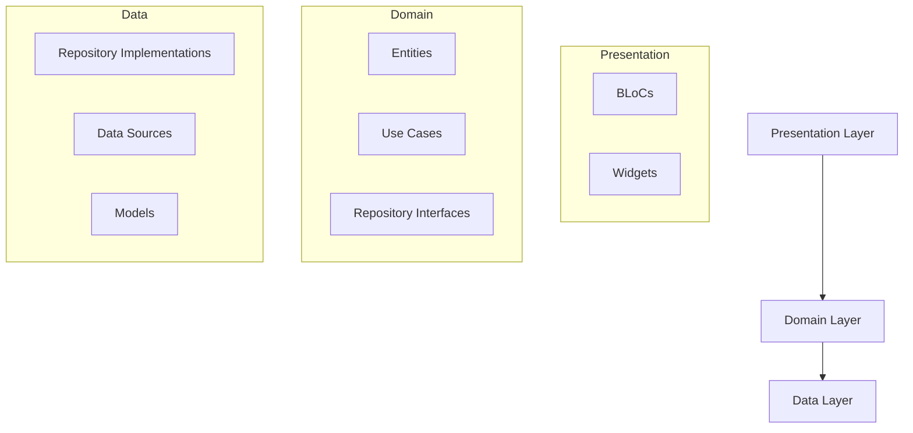

# Flutter Task Systems Ltd

A Flutter application for browsing products from the FakeStore API with offline support and clean architecture.

## Features

- 📱 Product listing with pull-to-refresh
- 🔍 Product details view
- ❤️ Favorites management
- 📶 Offline support with local caching
- 🌐 Multi-language support (English/Arabic)
- 🎨 Dark/Light theme support
- ✨ Shimmer loading effects

## Architecture

This project follows **Clean Architecture** with the BLoC pattern for state management.

### Why Clean Architecture?

| Benefit | Description |
|---------|-------------|
| **Separation of Concerns** | Each layer has a single responsibility |
| **Testability** | Business logic is isolated and easily testable |
| **Scalability** | Easy to add new features without affecting existing code |
| **Maintainability** | Code is organized and predictable |
| **Flexibility** | Data sources can be swapped without affecting business logic |

### Project Structure

```
lib/
├── core/                    # Shared utilities and services
│   ├── config/              # App configuration
│   ├── enums/               # Shared enums
│   ├── errors/              # Custom exceptions
│   ├── extensions/          # Dart extensions
│   ├── routing/             # Navigation/routing
│   ├── services/            # API, cache, connectivity services
│   ├── themes/              # App themes and extensions
│   ├── translations/        # Localization
│   ├── utils/               # Colors, styles, constants
│   └── widgets/             # Shared widgets
│
└── features/
    └── products/
        ├── data/            # Data layer
        │   ├── datasources/ # Remote & local data sources
        │   ├── models/      # Data models (JSON/Hive)
        │   └── repositories/# Repository implementations
        ├── domain/          # Domain layer
        │   ├── entities/    # Business entities
        │   ├── repositories/# Repository interfaces
        │   └── usecases/    # Business logic
        └── presentation/    # Presentation layer
            ├── controllers/ # BLoCs
            └── views/       # Screens & widgets
```

### Layer Responsibilities



- **Presentation**: UI components and BLoCs for state management
- **Domain**: Business entities, use cases, and repository contracts
- **Data**: API calls, local storage, and data transformations

## Setup Instructions

### Prerequisites

- Flutter SDK ^3.9.2
- Dart ^3.0.0
- Android Studio / VS Code with Flutter extensions

### Installation

1. **Clone the repository**
   ```bash
   git clone https://github.com/melshenawyarabapps/flutter_task_sys_ltd.git
   cd flutter_task_sys_ltd
   ```

2. **Install dependencies**
   ```bash
   flutter pub get
   ```

3. **Generate code** (Hive adapters & mocks)
   ```bash
   dart run build_runner build --delete-conflicting-outputs
   ```

4. **Run the app**
   ```bash
   flutter run
   ```

### Running Tests

```bash
# Run all tests
flutter test

# Run with coverage
flutter test --coverage
```

## Key Dependencies

| Package | Purpose |
|---------|---------|
| `flutter_bloc` | State management |
| `dio` | HTTP client |
| `hive_flutter` | Local database |
| `get_it` | Dependency injection |
| `easy_localization` | Internationalization |
| `connectivity_plus` | Network status |
| `cached_network_image` | Image caching |

## API

This app uses the [FakeStore API](https://fakestoreapi.com/) for product data.

## License

MIT License
